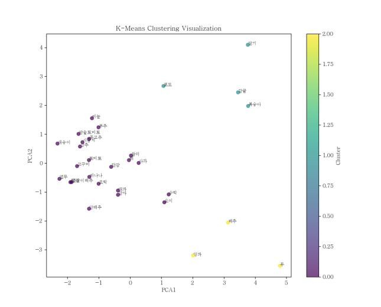
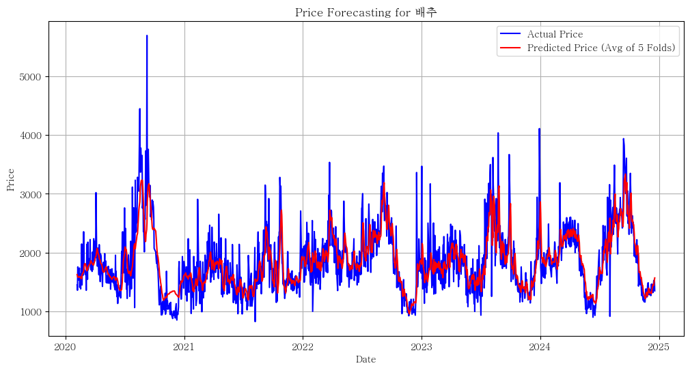
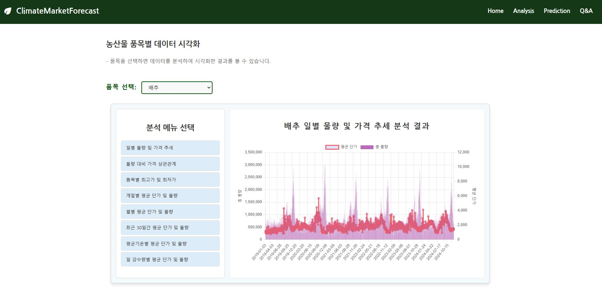
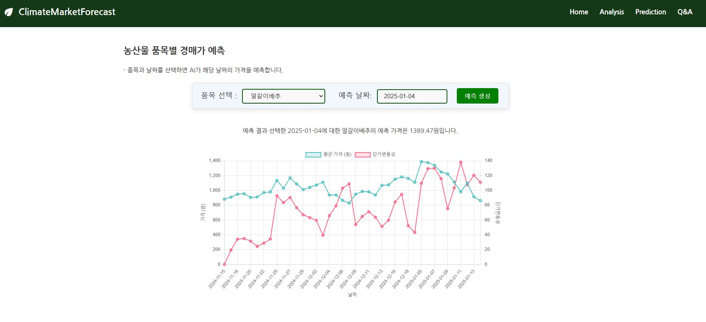

# 프로젝트 이름 :   
### ClimateMarketForecast    
<br>
  
# 프로젝트 주제 :   
기후 변화와 도매시장 데이터를 기반으로 한 시계열 예측 모델링. 기후 데이터와 도매시장의 품목(30개 품목)별 거래 현황을 분석하여 미래의 거래 흐름을 예측하는 모델을 개발.  
<br>

# 사용 데이터 :   
1. 농산물 경매 데이터([도매시장 통합 홈페이지](https://at.agromarket.kr/domeinfo/smallTrade.do))

2. 기상청 기상자료개방포털( [기상청 기상자료개방포털](https://data.kma.go.kr/data/grnd/selectAsosRltmList.do?pgmNo=36))  
<br>

# 데이터 주요 변수 :   
- total_quantity: 거래된 총 물량 (kg).
- temperature_range: 하루 동안의 온도차 (°C).
- average_temperature: 일 평균 기온 (°C).
- daily_rainfall: 일 강수량 (mm).
- sales_amount: 하루 동안의 총 거래 금액 (원).
- quantity_price_ratio: 총 물량 대비 가격 비율.
- price_volatility: 가격 변동성 (일별 표준편차).
- quantity_volatility: 물량 변동성 (일별 표준편차).
- season: 계절 (봄, 여름, 가을, 겨울) → 원-핫 인코딩.
- 타겟 변수: average_price (평균 단가, 원/kg).  
<br>

# 사용 모델 :   
### LSTM
- 모델 유형 : 시계열 예측을 위한 순환 신경망 (RNN) 기반 모델.  
- 사용 이유 :  
    - 시간적 의존성과 계절성을 학습하는 데 적합.  
    - 농산물 거래 데이터의 패턴을 효과적으로 예측.  
- 구성 요소 :
    - LSTM 레이어: 2개 (유닛 수: 50~100)  
    - 활성화 함수: ReLU  
    - 드롭아웃율: 20% (과적합 방지)
    - Dense 레이어: 출력 뉴런: 1개 (예측 값: 평균 단가)
    - 손실 함수: Mean Squared Error (MSE)  
    - 최적화 함수: Adam Optimizer  
- 평가 지표 :
    - Mean Absolute Error (MAE): 절대 오차 평균.
    - Mean Absolute Percentage Error (MAPE): 절대 오차의 비율 평균.
    - R²: 설명력 지표.
- 모델 훈련 과정 : 
    - 데이터 전처리 : K-Means Clustering
    - 교차 검증: TimeSeriesSplit으로 시계열 5분할
    - 조기 종료: EarlyStopping으로 검증 손실(val_loss)이 5번의 에포크 동안 개선되지 않으면 종료
    - 하이퍼파라미터 튜닝
- 출력 : 특정 품목의 평균 단가 예측.  

  
<br>  

# 웹 기능
- 분석 시각화 : 품목과 분석 항목 선택 시 데이터를 시각화하여 표시
- 평균 단가 예측
    - 품목과 기준 날짜 선택 시 선택 날짜의 예측 평균단가 텍스트로 표시
    - 과거 데이터와 예측 데이터를 결합하여 선 그래프로 시각화  

  
<br>

# 사용 기술 :   
- 언어 : python
- 모델 구축 : TensorFlow/Keras
- 전처리 및 시각화 : pandas, numpy, matplotlib
- 웹 구현 : flask, janja2, javascript
- 웹 라이브러리 : Chart.js, Flatpickr
- DB : Mysql  
<br>

  
## 폴더구조
```plaintext
📁 FESTIVAL
├── 📁 analysis       --- 데이터 분석 및 시각화
├── 📁 crawlings      --- 데이터 수집 코드
├── 📁 data           --- 실제 분석/모델에 사용된 데이터
│   └── 📁 processed  --- 전처리된 데이터 
│   └── 📁 raw        --- 원본 데이터 
├── 📁 db             --- db 관련 코드
├── 📁 models         --- 모델 관련 코드
├── 📁 preprocessing  --- 전처리 코드 
├── 📁 saved_models   --- 학습된 모델 저장
├── 📁 web            --- Django 프로젝트 폴더
│   └── 📁 routes     
│   └── 📁 services   
│   └── 📁 static     
│   └── 📁 templates  
│   └── 📄 app.py     --- web 실행 파일
│   └── 📄 config.py  --- web 설정 파일
├── 📄 .gitignore     --- Git 무시 파일 설정
├── 📄 README.md      
└── 📄 requirements.txt --- 설치 파일 
```
<br>

## 설치 방법
```bash
pip install -r requirements.txt
```